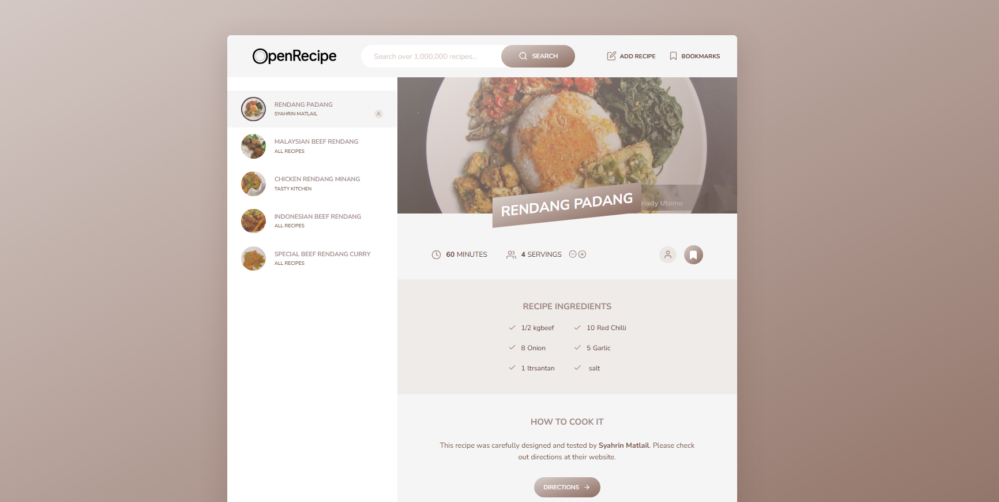

# 🍴 OpenRecipe - Recipe Finder & Creator



OpenRecipe is a web application for finding food recipes, creating your own recipes, and adjusting ingredients according to desired portions. With OpenRecipe, you can explore various recipes from around the world, save favorites, and even share your personal recipe creations.

## DEMO

[OpenRecipe Website](https://project-openrecipe.netlify.app/)

---

## ✨ Key Features

- **Recipe Search**: Browse thousands of recipes using an external API that delivers fast and relevant results.
- **Create Your Own Recipes**: Craft new recipes and save them in local storage for easy future access.
- **Bookmark Favorite Recipes**: Mark your favorite recipes for quick retrieval later.
- **Portion Adjustment**: Modify serving sizes and ingredients will update automatically.
- **Responsive & Fast**: Built with Parcel bundler for optimal performance and quick page loading.

---

## 🛠️ Tech Stack

OpenRecipe is built using the **MVC (Model-View-Controller)** architecture for clean and structured code organization. Here are the core technologies used:

- **JavaScript (ES6+)**: Primary language for application logic.
- **Parcel Bundler**: Simplifies development and production build processes.
- **SASS**: Provides structured CSS writing.
- **Core-js & Regenerator-runtime**: Ensures cross-browser compatibility.
- **Fractional.js**: Displays ingredient quantities in easy-to-understand fractions.

---

## 🚀 Getting Started

Follow these steps to set up the project in your local environment.

### Prerequisites

- **Node.js** (latest version recommended)

### Installation

1. **Clone Repository**:
   ```bash
   https://github.com/Anntasena/PROJECT-OpenRecipe.git
   ```

---

### 📄 Project Structure

```
.
├── src/
│   ├── img/                 # Images and icons
│   ├── js/                  # JavaScript scripts
│   │   ├── model.js         # Data processing and application state
│   │   └── view/            # View components
│   └── scss/                # SASS files for styling
├── index.html               # Main HTML file
├── package.json             # Dependencies configuration
└── README.md                # Project documentation
```
