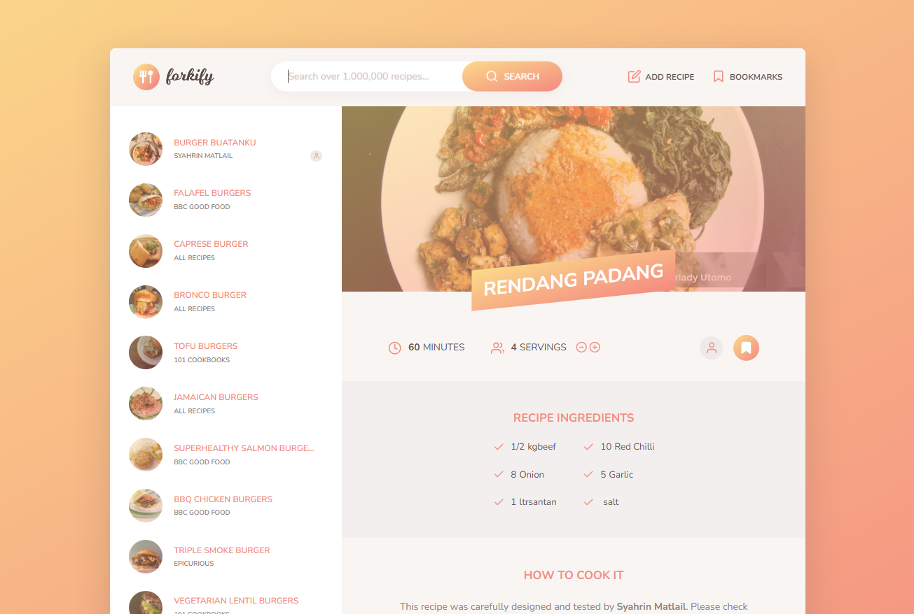

# 🍴 Forkify - Recipe Finder & Creator



Forkify adalah aplikasi web untuk mencari resep makanan, membuat resep sendiri, dan menyesuaikan bahan-bahan sesuai dengan porsi yang diinginkan. Dengan Forkify, Anda bisa mengeksplorasi berbagai resep dari seluruh dunia, menyimpan favorit, hingga berbagi kreasi resep pribadi.


---

## ✨ Fitur Utama

- **Pencarian Resep**: Telusuri ribuan resep menggunakan API eksternal yang memberikan hasil cepat dan relevan.
- **Membuat Resep Sendiri**: Ciptakan resep baru dan simpan di local storage untuk kemudahan akses di masa mendatang.
- **Bookmark Resep Favorit**: Tandai resep favorit agar mudah ditemukan di lain waktu.
- **Penyesuaian Porsi**: Sesuaikan jumlah porsi dan bahan akan otomatis diperbarui.
- **Responsive & Cepat**: Dikembangkan dengan Parcel bundler untuk performa optimal dan pemuatan halaman yang cepat.

---

## 🛠️ Tech Stack

Forkify dibangun dengan pendekatan arsitektur **MVC (Model-View-Controller)** untuk struktur kode yang bersih dan terstruktur. Berikut adalah teknologi utama yang digunakan:

- **JavaScript (ES6+)**: Bahasa utama untuk membangun logika aplikasi.
- **Parcel Bundler**: Mempermudah proses development dan build production.
- **SASS**: Menyediakan penulisan CSS yang terstruktur.
- **Core-js & Regenerator-runtime**: Menjamin kompatibilitas di berbagai browser.
- **Fractional.js**: Menampilkan jumlah bahan dalam bentuk pecahan yang mudah dipahami.

---

## 🚀 Getting Started

Berikut adalah langkah-langkah untuk memulai proyek ini di lingkungan lokal Anda.

### Prerequisites

- **Node.js** (disarankan versi terbaru)

### Installation

1. **Clone Repository**: 
   ```bash
   git clone https://github.com/Anntasena/PROJECT-forkify


---

### 📄 Project Structure


-├── src/
-│   ├── img/                 # Gambar dan ikon
-│   ├── js/                  # Script JavaScript
-│   │   ├── model.js         # Pengolahan data dan state aplikasi
-│   │   ├── view/            # Komponen tampilan
-│   └── scss/                # File SASS untuk styling
-├── index.html               # File HTML utama
-├── package.json             # File konfigurasi dependencies
-└── README.md                # Dokumentasi proyek


